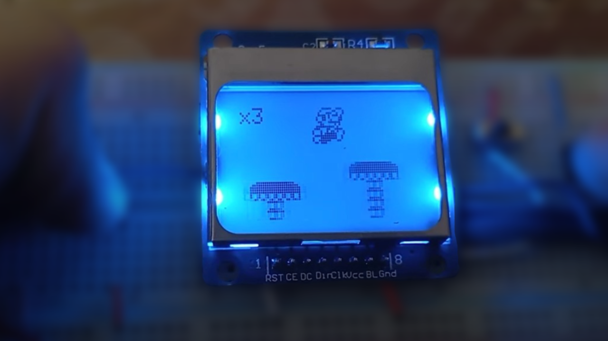

# Arduino ile Mario Projesi



## Arduino ile Mario Projesi
Arduino ve elektronik komponentleri bir araya getirerek, kendi oyun konsolumuzu yapıyoruz! 🎮✨

[Projenin Sitesi](https://github.com/tobiasbu/marduino)

## Video

Proje hakkında daha fazla bilgi almak için aşağıdaki videoyu izleyebilirsiniz:
[Arduino ile Mario!](https://www.youtube.com/watch?v=YPNLednISC0)

## Malzeme Listesi

- [Arduino Nano](#)
- [5110 LCD Ekran](#)
- [Breadboard](#)
- [4x Push Buton](#)
- [Kablolar](#)

---

## Arduino Kodu

```cpp
/***************************************************************************
*                                                                          *
*       Arduino ile Mario Projesi                                          *
*       Youtube: https://youtu.be/YPNLednISC0                               *
*                                                                          *
***************************************************************************/
#include <Adafruit_GFX.h>
#include <Adafruit_PCD8544.h>

Adafruit_PCD8544 display = Adafruit_PCD8544(5, 4, 3, 2, 1); // Ekran pinleri

int buttonState = 0;
int previousButtonState = 0;
int marioPosition = 10;

void setup() {
  display.begin();
  display.setContrast(50);
  display.clearDisplay();
}

void loop() {
  buttonState = digitalRead(6);

  if (buttonState == HIGH && previousButtonState == LOW) {
    marioPosition += 5;
  }

  previousButtonState = buttonState;

  display.clearDisplay();
  display.setCursor(marioPosition, 20);
  display.print("MARIO");
  display.display();
  delay(100);
}
